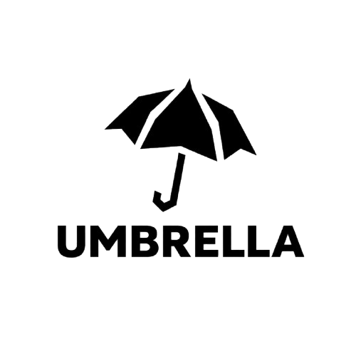
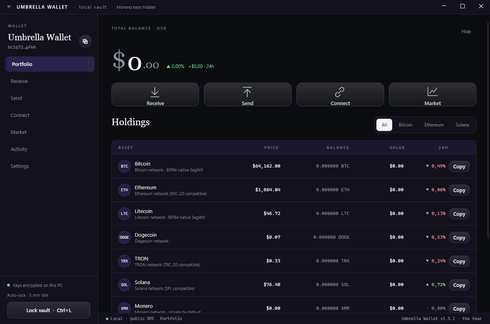
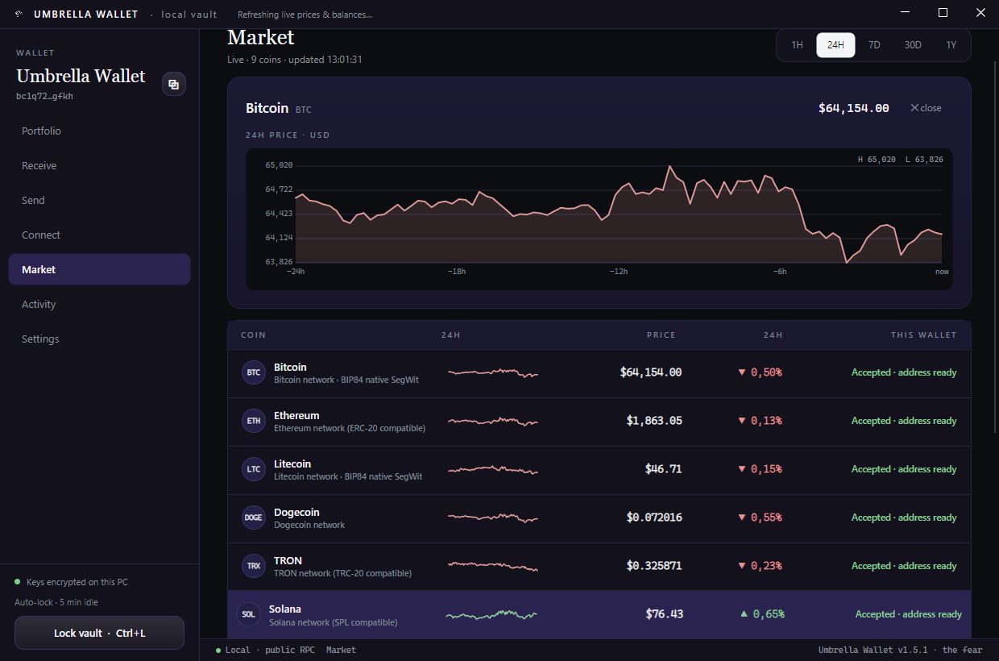

<div align="center">

<picture>
  <source media="(prefers-color-scheme: dark)" srcset="docs/assets/umbrella-logo-solidwhite.png" width="150"/>
  
</picture>

# ☂️ Umbrella Wallet

### Your money. Your keys. Nobody watching.

**The crypto wallet that never asks who you are.**
No account. No email. No phone number. No KYC. Just a wallet — the way it was meant to be.

<br/>


<br/>



<sub>a project by  <b>the fear</b> · owner <a href="https://github.com/kiurakku">kiurakku</a> · © 2026</sub>

</div>

---

## 🌂 Why Umbrella?

Every mainstream wallet and exchange wants your passport, your face, your phone — and then keeps your coins on **their** servers. When they freeze, get hacked, or simply decide you're "suspicious", your money stops being yours.

Umbrella flips that model:

- 🕵️ **Truly anonymous.** Install and go. There is no registration screen, because there is nothing to register. Nothing in the app identifies you.
- 🔑 **You hold the keys.** Your 24-word recovery phrase is created on *your* computer and never leaves it. Not to us, not to anyone. We literally *cannot* touch your funds — that's the point.
- 🧅 **Tor built in.** Flip one switch and the wallet's traffic goes through the Tor network — no separate install, no configuration. Your IP stays out of your finances.
- 🥷 **Secrets that can't be screenshotted.** While your recovery phrase is on screen, the window renders black to screen-capture and remote-viewing software.
- 💸 **Real money movement.** Send and receive Bitcoin, Ethereum, USDT, Monero and more — to any wallet or exchange in the world. Transactions are signed on your machine; only the signed result ever goes out.
- 🎨 **Yours to look at.** Ten colour themes (including OLED black, light, and gradients), six interface languages, movable navigation, animated stickers. A private wallet doesn't have to feel like a tax form.

<div align="center">

<br/><sub>Live market · exchange-style charts · 1H to 1Y</sub>
</div>

## 💼 What you can do

| | |
|---|---|
| 📥 **Receive** | One tap shows a QR + address for any coin. Colour-coded so you never receive on the wrong network. |
| 📤 **Send** | To any address or exchange deposit. Clear review step, economical fees by default. |
| 👁️ **Watch** | Track any public address (your Ledger, an old MetaMask) without ever importing a key. |
| 🏦 **Link exchanges** | See your Binance, Bybit, OKX, Kraken, KuCoin, Gate.io, MEXC, Bitget and Telegram CryptoBot balances beside your on-chain coins — via **read-only** keys that can't move funds. |
| 📊 **Follow the market** | Real candles, five time windows, auto-refresh — for every listed coin. |
| 💾 **Back up** | One click exports an encrypted backup file. Useless to a thief, priceless to future-you. |

## 🪙 Coins

| Coin | Receive | Send | Notes |
|------|:-------:|:----:|-------|
| Bitcoin (BTC) | ✅ | ✅ | native SegWit |
| Ethereum (ETH) | ✅ | ✅ | ERC-20 compatible address |
| **USDT (TRC-20)** | ✅ | ✅ | Tether on TRON — fee paid in TRX |
| **Monero (XMR)** | ✅ | ✅ | full private wallet, powered by Monero's own engine |
| Litecoin (LTC) | ✅ | ✅ | native SegWit |
| Solana (SOL) | ✅ | ✅ | |
| TRON (TRX) | ✅ | ✅ | |
| Dogecoin (DOGE) | ✅ | ➖ | receive + balance |
| TON · Cardano | 🚧 | 🚧 | coming — held back until address generation is verified to the letter, because a wrong address loses coins |

## 🚀 Get started

**Windows** — download `UmbrellaWallet-Setup.exe` (installer, choose your folder) or the portable exe. Run, create a wallet, write down your 24 words. That's it — you have a bank in your pocket that answers to no one.

**Linux** — grab the tar.gz build, unpack, run `./Umbrella.Wallet.App`.

**Web** — the browser version pairs a React front-end with a back-end that only ever sees *public* data. Your phrase stays in your browser.

> ✍️ **Write the 24 words on paper.** They are the wallet. Anyone who has them has your money; if you lose them and your device, nobody in the universe can bring your coins back — including us. That is what "your keys" costs, and what it's worth.

## 🛠️ For builders

<details>
<summary>Build from source (click to expand)</summary>

**Desktop** (.NET 8 + Avalonia):

```bash
cd desktop
dotnet run --project src/Umbrella.Wallet.App/Umbrella.Wallet.App.csproj   # run
dotnet test                                                               # 77 tests, crypto pinned to published vectors
```

Windows release: `./scripts/fetch-tor.ps1`, `./scripts/fetch-monero.ps1`, then `dotnet publish -r win-x64`.
Linux release: `./scripts/publish-linux.sh` (fetches Linux Tor/Monero helpers, packs a tar.gz).

**Web** (React + NestJS):

```bash
npm install && npm run dev                        # frontend
cd backend && npm install && npm run start:dev    # backend
```

Specs: [`UMBRA_BACKEND_SPEC.md`](./UMBRA_BACKEND_SPEC.md) · [`UMBRA_AGGREGATOR_ADDENDUM.md`](./UMBRA_AGGREGATOR_ADDENDUM.md) · [`DEPLOY.md`](./DEPLOY.md) · [`CHANGELOG.md`](./CHANGELOG.md)

**Security internals:** 256-bit seed from the OS CSPRNG → BIP39 · vault encrypted with Argon2id (64 MiB) + AES-256-GCM · Monero keys go only to the local audited `monero-wallet-rpc` · Tor Expert Bundle on a private SOCKS port · backups exported still-encrypted.

</details>

## ⚠️ The honest part

Umbrella is **non-custodial**. That word means: *we never hold your money, so we can never lose it, freeze it — or recover it.* You are the bank now. Guard your phrase, check addresses before sending, start with a small test amount. Crypto transactions are final; there is no undo button anywhere in the world. The software is provided as-is, without warranty — see [LICENSE](LICENSE). Nothing here is financial advice.

## 💬 Support

Made and maintained by **[kiurakku](https://github.com/kiurakku)**. Questions and bug reports are welcome as issues in this repository — answered with care, on a best-effort basis, without creating any legal obligation.

## 📄 License

**Free to use. Not free to take.** Umbrella is the property of **kiurakku**; anyone may download and use it at no charge, but copying, modifying or republishing it is not permitted. The author carries no legal or financial liability for how it is used — full terms in [LICENSE](LICENSE).

---

<div align="center">

<br/>
<sub><b>the fear</b> · privacy · self-custody · no middlemen<br/>© 2026 kiurakku · all rights reserved</sub>
</div>
