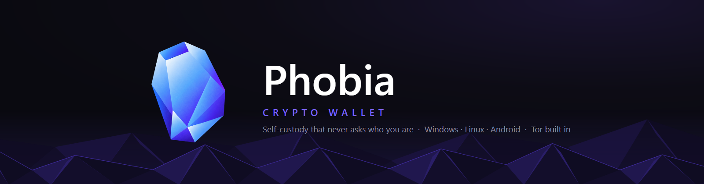
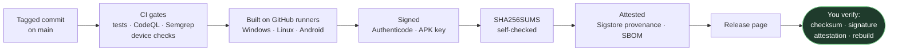
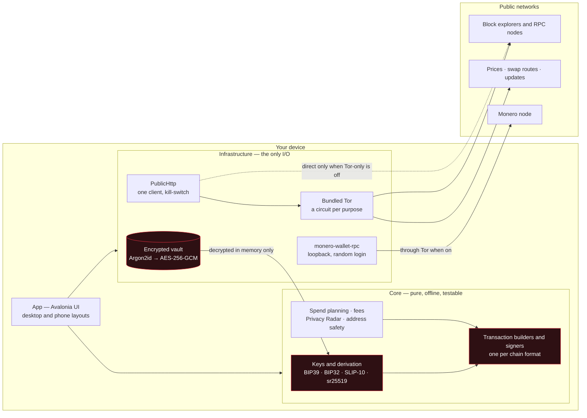
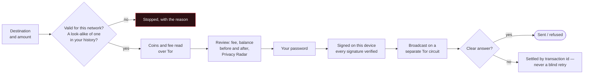

<div align="center">



# Phobia Wallet

### Open-source, non-custodial privacy wallet with Tor built in

**18 blockchains in one encrypted vault — Monero as a full wallet — on Windows, Linux and Android.**<br/>
No account · no email · no KYC · no tracking · no fee on your transfers.

[](https://github.com/thefear078/Phobia-Wallet/actions/workflows/ci.yml)
[](https://github.com/thefear078/Phobia-Wallet/actions/workflows/codeql.yml)
[](https://github.com/thefear078/Phobia-Wallet/actions/workflows/semgrep.yml)
[](https://scorecard.dev/viewer/?uri=github.com/thefear078/Phobia-Wallet)
[](https://github.com/thefear078/Phobia-Wallet/releases)
[](LICENSE)


**[⬇ Download the Beta](https://github.com/thefear078/Phobia-Wallet/releases/tag/v4.10.0-beta.6)** ·
[Verify a download](docs/BUILD_VERIFY.md) ·
[Build from source](#build-from-source) ·
[Feature tour](docs/FEATURES.md) ·
[Security](SECURITY.md) ·
[Docs](docs/INDEX.md) ·
[Telegram](https://t.me/PhobiaStat)

<br/>


</div>

> [!NOTE]
> **Phobia is in beta, and Umbrella Wallet is now Phobia Wallet** — same code, same keys, same encrypted
> vault. A beta copy finds the newer Beta by itself; a stable 4.9.0 copy is never offered a beta, so install
> the Beta over it and the vault and settings stay. An Android copy installed before 7 October 2026 needs
> one reinstall ([why](docs/guides/android.md#updating)).

## Why Phobia

<table>
<tr>
<td width="33%" valign="top">

### 🔐 Your keys, your device
The 24-word seed is made and encrypted on your device (Argon2id → AES-256-GCM) and never leaves it. There
is no account and no server that knows you exist — nobody can freeze, seize or "recover" your funds.

</td>
<td width="33%" valign="top">

### 🧅 Tor in the box
One switch starts a bundled Tor client. A kill-switch fails closed, every kind of request gets its own
circuit, and names never touch your DNS. The app tells you which server learns what.

</td>
<td width="33%" valign="top">

### 🪙 One vault, 18 chains
Bitcoin, Ethereum and every ERC-20, Monero as a real wallet, USDT on TRON, Solana, XRP and more — each one
can receive, send, show its balance and read its history.

</td>
</tr>
</table>

## Key features

**Privacy**
- Bundled **Tor** with a fail-closed kill-switch and a separate circuit per purpose — on the phone too.
- **Settings → Privacy** lists every server the wallet contacts and what it learns; point any chain at your own node.
- **Privacy Radar** shows, before you send, what the transaction would reveal on-chain — analysed offline.
- No telemetry, no analytics, no crash reports. Nothing about you leaves the device.

**Security**
- Encrypted vault; your password again before every send; auto-lock; seed screens hidden from screenshots.
- Warnings for **address poisoning**, wrong-network addresses and look-alikes of your own; a **duress password**.
- One amount box with its unit on it, a review that puts warnings first, and a receipt for every send;
  an unclear broadcast is settled against the chain — never offered as a retry that would pay twice.
- Signed, attested releases with an SBOM; the code that derives keys and signs **rebuilds byte for byte**.

**Money**
- **Monero** through the real `monero-wallet-rpc` on your machine; Bitcoin with coin control, Taproot, PSBT and PayJoin.
- Tokens: every **ERC-20, TRC-20, SPL** (Token-2022 too) and TON jetton you hold.
- **Swaps** between any coins, each on its own network, to your own address — the route named before you pay.
- **Staking** for TRX, SOL and ATOM, signed in the wallet. **No platform fee**, ever.

**Every day**
- A balance chart drawn through your own transfers, an exchange-style market chart, Activity with fiat values
  and the whole history the wallet has read, CSV export, encrypted notes on transfers and names for addresses.
- 15 themes, 6 languages, desktop and phone layouts, updates that check their own checksums.

See all of it, screen by screen, in the **[feature tour](docs/FEATURES.md)**.

## Screenshots

<table>
<tr>
<td width="50%"><br/><sub><b>Market</b> — candles, volume, crosshair, over Tor</sub></td>
<td width="50%"><br/><sub><b>Security Center</b> — what actually protects you, right now</sub></td>
</tr>
<tr>
<td width="50%"><br/><sub><b>Activity</b> — every chain's history, with what it was worth</sub></td>
<td width="50%"><br/><sub><b>Receive</b> — the network printed under every coin</sub></td>
</tr>
</table>

<p align="center">


<br/><sub>The same wallet on Android, with its own Tor and Monero service · <a href="docs/FEATURES.md#themes-and-languages">15 themes</a></sub>
</p>

## Supported coins

Every row in the wallet prints the network under the coin name — sending on the wrong network is the
most common way people lose money.

| Coin | Receive | Balance | Send | History | Swap | Notes |
|---|:---:|:---:|:---:|:---:|:---:|---|
| Bitcoin (BTC) | ✅ | ✅ | ✅ | ✅ | ✅ | native SegWit, full HD scan, coin control, PSBT, PayJoin |
| Ethereum (ETH) | ✅ | ✅ | ✅ | ✅ | ✅ | + every ERC-20 at the same address, fee in ETH |
| Litecoin (LTC) | ✅ | ✅ | ✅ | ✅ | ✅ | native SegWit, full HD scan |
| Dogecoin (DOGE) | ✅ | ✅ | ✅ | ✅ | ✅ | |
| Bitcoin Cash (BCH) | ✅ | ✅ | ✅ | ✅ | ✅ | CashAddr |
| Monero (XMR) | ✅ | ✅ | ✅ | ✅ | ✅ | local `monero-wallet-rpc`, loopback only |
| Solana (SOL) | ✅ | ✅ | ✅ | ✅ | ✅ | + SPL tokens, Token-2022 when its extensions allow |
| TRON (TRX) | ✅ | ✅ | ✅ | ✅ | ✅ | + every TRC-20 at the same address |
| USDT (TRC-20) | ✅ | ✅ | ✅ | ✅ | ✅ | same address as TRX; fee paid in TRX |
| TON | ✅ | ✅ | ✅ | ✅ | 🟡 | wallet v4R2, jettons |
| Cardano (ADA) | ✅ | ✅ | ✅ | ✅ | ✅ | CIP-1852 |
| Zcash (ZEC) | ✅ | ✅ | ✅ | ✅ | ✅ | **transparent `t1…` only** — not shielded |
| XRP Ledger (XRP) | ✅ | ✅ | ✅ | ✅ | ✅ | destination tag for exchange deposits |
| Stellar (XLM) | ✅ | ✅ | ✅ | ✅ | ✅ | memo for exchange deposits |
| Cosmos Hub (ATOM) | ✅ | ✅ | ✅ | ✅ | ✅ | memo; staked ATOM not counted in the balance |
| NEAR Protocol (NEAR) | ✅ | ✅ | ✅ | ✅ | ✅ | implicit account, to any `.near` name |
| Polkadot (DOT) | ✅ | ✅ | ✅ | ✅ | — | same account as Polkadot.js / Nova; no route trades native DOT |
| Nano (XNO) | ✅ | ✅ | ✅ | ✅ | ✅ | no fee — proof of work computed on your device |
| Decred (DCR) | ✅ | ✅ | ✅ | ✅ | ✅ | the BIP44 account of Trust Wallet / Ledger / Exodus |
| Linea (ETH) | ✅ | ✅ | ✅ | — | — | no keyless history source; your own sends still show |
| zkSync Era (ETH) | ✅ | ✅ | ✅ | ✅ | — | history while you hold ETH there |

Plus the native coin of the major EVM networks at your `0x` address (BNB, MATIC, AVAX, FTM, CRO, and ETH on
Arbitrum, Optimism and Base), and NFTs listed by name with **no image fetch**. 🟡 = a swap route exists but did
not quote that coin when last checked. Per-chain detail: **[docs/12-coins-and-chains.md](docs/12-coins-and-chains.md)**.

## Download


The current build is the **Beta** of 10 October 2026, a GitHub pre-release; older builds are on the
[releases page](https://github.com/thefear078/Phobia-Wallet/releases). The icon on the right is what you
will see once it is installed.

| | |
|---|---|
| **Windows installer** | [`PhobiaWallet-Setup-Beta.exe`](https://github.com/thefear078/Phobia-Wallet/releases/download/v4.10.0-beta.6/PhobiaWallet-Setup-Beta.exe) |
| **Windows portable** | [`PhobiaWallet-Beta-win-x64-portable.exe`](https://github.com/thefear078/Phobia-Wallet/releases/download/v4.10.0-beta.6/PhobiaWallet-Beta-win-x64-portable.exe) — one file, no install |
| **Linux** | [`PhobiaWallet-Beta-linux-x64.tar.gz`](https://github.com/thefear078/Phobia-Wallet/releases/download/v4.10.0-beta.6/PhobiaWallet-Beta-linux-x64.tar.gz) — Tor and Monero included |
| **Android** | [`PhobiaWallet-Beta-android.apk`](https://github.com/thefear078/Phobia-Wallet/releases/download/v4.10.0-beta.6/PhobiaWallet-Beta-android.apk) — Android 7.0+, [how to install](docs/guides/android.md) |
| **Checksums** | [`SHA256SUMS-Beta.txt`](https://github.com/thefear078/Phobia-Wallet/releases/download/v4.10.0-beta.6/SHA256SUMS-Beta.txt) |

**Check before you run anything:**

```bash
sha256sum -c SHA256SUMS-Beta.txt --ignore-missing                      # the file is the one published
gh attestation verify PhobiaWallet-Setup-Beta.exe --repo thefear078/Phobia-Wallet   # and it was built here
```

Every file goes through the same chain before it reaches you, and every link of it can be checked
without trusting this page:



Windows files and the APK are also signed by the author (Windows thumbprint
`89C2D871C195D57C14D1911B6C47629DE052C553`, self-signed for now; APK certificate in
[SECURITY.md](SECURITY.md#verifying-what-you-run)). All the checks, and rebuilding it yourself:
**[docs/BUILD_VERIFY.md](docs/BUILD_VERIFY.md)**. The release page also carries numbered copies
(`…-Beta-5…`) — the same bytes, for older copies' updaters; you need only the files above.

## Quick start

### Use it

1. **Create** a wallet, or **import** any BIP39 phrase (12–24 words) — the addresses match the original wallet.
2. Write the 24 words on **paper**; the wallet then asks for three of them, to catch a mistake while it costs nothing.
3. Turn **Tor** on in Settings *before* you unlock, so no address is ever queried over clearnet.
4. Send a **small test amount** to any new address first. A blockchain transfer is final.

More in **[docs/getting-started.md](docs/getting-started.md)** and the **[user guides](docs/guides/README.md)**
(also [in Ukrainian](docs/guides/user-guide-uk.md)).

### Build from source

You need the [.NET 8 SDK](https://dotnet.microsoft.com/download/dotnet/8.0) (pinned in [`global.json`](global.json)). Nothing else.

```bash
git clone https://github.com/thefear078/Phobia-Wallet.git
cd Phobia-Wallet
dotnet build desktop/Umbrella.Wallet.sln -c Release                                 # build
dotnet run --project desktop/src/Umbrella.Wallet.App                                # run
dotnet test desktop/Umbrella.Wallet.sln -c Release --filter "Category!=Live"        # ~1,950 offline tests
```

Installers, the portable exe, the Linux tarball and the Android APK: **[docs/building.md](docs/building.md)**.

## Architecture



**The rule the layout enforces:** `Core` never touches the network, so every piece of money logic —
derivation, coin selection, fee maths, amount parsing, transaction formats, privacy analysis — is tested
offline against published vectors and real mainnet transactions. Everything that talks to the outside
world lives in `Infrastructure` and goes through one Tor-aware client. Layers, data flow and the send path:
**[docs/architecture.md](docs/architecture.md)**.

## Security and privacy

Sending is where a wallet loses people's money, so every chain's send takes the same guarded path:



The step by step, with what each one prevents: [docs/architecture.md](docs/architecture.md#the-send-path).

| Never leaves your device | Leaves it (behind Tor when Tor is on) |
|---|---|
| Your seed phrase and every private key | The addresses you look up |
| Your vault password | Transactions you broadcast |
| Your private transaction notes | Coin prices you fetch (one fixed list for everyone) |

- **[SECURITY.md](SECURITY.md)** — how to report a vulnerability (privately, [via an advisory](https://github.com/thefear078/Phobia-Wallet/security/advisories/new)), what is in scope, how we respond.
- **[THREAT_MODEL.md](THREAT_MODEL.md)** — what is defended, and where the defence ends.
- **[PRIVACY.md](PRIVACY.md)** — every server the wallet contacts and what it learns.
- **[docs/SECURITY_REVIEW.md](docs/SECURITY_REVIEW.md)** — the code read from an attacker's side: secrets in logs, memory, files at rest, local services.

No external audit has been done yet ([AUDIT_STATUS.md](AUDIT_STATUS.md)). Please don't open a public issue
for anything that could put funds at risk.

## Quality

- **1,950+ offline tests** on every push: derivation and signing pinned to official vectors and to
  transactions the networks accepted, amount parsing, spend planning, privacy on the wire (a SOCKS5 server
  reads each request's circuit, a listener proves the kill-switch opens no socket), and every screen
  rendered headless on desktop and phone.
- **Device checks** on every pull request: the APK on an Android emulator with its Tor bootstrapping, and
  the Linux build on a virtual display reaching check.torproject.org through its own Tor.
- **Static analysis and supply chain:** CodeQL, Semgrep, Dependabot, dependency review, gitleaks, secret
  scanning, OpenSSF Scorecard; Tor and Monero pinned to their projects' signed hashes; a reproducible-build check.
- **Coverage** published weekly. How it all fits together: **[docs/testing.md](docs/testing.md)**.

### Results

Measured on **9–10 October 2026** against `main` and the current Beta — re-run them yourself with the commands
in [docs/testing.md](docs/testing.md) and [docs/BUILD_VERIFY.md](docs/BUILD_VERIFY.md).

| Check | Result |
|---|---|
| Offline test suite | ✅ **1,958 / 1,958** passed · rendered screens **4 / 4** |
| Line coverage of the offline suite | **Core 90.6 %** — the money logic: derivation, signing, fees, parsing · Infrastructure 41.9 % (network code; the live tests cover it instead) · App 54.1 % · **58.5 %** overall ([by assembly](docs/testing.md#coverage)) |
| Static analysis | ✅ CodeQL: **0** open alerts · ✅ Semgrep: **0** findings — 76 rules over 427 C# files, the workflows and secrets |
| Live tests against real explorers and nodes | ✅ **48 / 49** — the one left: an explorer rate-limiting this machine |
| Android emulator: app starts, bundled Tor bootstraps | ✅ passed |
| Linux desktop: the build reaches check.torproject.org through its own Tor | ✅ passed |
| Release files against their checksum lists | ✅ **11 / 11** byte for byte |
| Build attestations (Sigstore) · Windows signatures | ✅ all verified · ✅ thumbprint `89C2…C553`, timestamped |
| Decred send: a wrong-key payment from a real coin | ✅ refused by mainnet **only** at the signature |
| Dependabot · secret scanning alerts | ✅ **0** open · ✅ **0** open |
| OpenSSF Scorecard | **6.2 / 10** before this round of fixes (workflow permissions, pinned packages, provenance on releases); most of the rest needs a second reviewer, fuzzing and the OpenSSF best-practices badge ([live score](https://scorecard.dev/viewer/?uri=github.com/thefear078/Phobia-Wallet)) |
| External security audit | ❌ none yet — [AUDIT_STATUS.md](AUDIT_STATUS.md) |

## Roadmap

| | |
|---|---|
| ✅ Shipped | 18 chains with send and history · Tor + kill-switch · Monero full wallet · swaps · staking · Security Center · Privacy Radar · PSBT and PayJoin · duress password · signed, attested releases with SBOM |
| 🔜 Next | Seedless watch-only mode · Ledger / Trezor |
| 🧪 Beta | Android, with its own Tor and Monero service |
| 🗓 Planned | Byte-for-byte reproducible installers · a CA-issued Windows certificate · an external security audit |
| ❌ Never | Advertising · telemetry · custody of your funds · venture funding |

The full backlog: **[docs/ROADMAP.md](docs/ROADMAP.md)** · every release: **[CHANGELOG.md](CHANGELOG.md)**.

## Contributing

Phobia is MIT-licensed and welcomes contributions — start with an issue labelled
[**good first issue**](https://github.com/thefear078/Phobia-Wallet/issues?q=is%3Aissue+is%3Aopen+label%3A%22good+first+issue%22)
or [**help wanted**](https://github.com/thefear078/Phobia-Wallet/issues?q=is%3Aissue+is%3Aopen+label%3A%22help+wanted%22).

- **[CONTRIBUTING.md](CONTRIBUTING.md)** — setup, tests, what a good pull request looks like.
- **[Add a coin](docs/adding-a-chain.md)** · **[a language](docs/localization.md)** · **[a theme](docs/theming.md)** · **[fork it](docs/forking.md)**.

Anything that touches the send path, the vault or key derivation needs tests — those are the paths where a
bug costs somebody their money.

## Documentation

| Use the wallet | Trust the wallet | Work on the wallet |
|---|---|---|
| [Getting started](docs/getting-started.md) | [Security policy](SECURITY.md) | [Architecture](docs/architecture.md) |
| [User guides](docs/guides/README.md) · [Українською](docs/guides/user-guide-uk.md) | [Threat model](THREAT_MODEL.md) | [Building](docs/building.md) |
| [Android](docs/guides/android.md) | [Privacy](PRIVACY.md) | [Testing and QA](docs/testing.md) |
| [Feature tour](docs/FEATURES.md) | [Verify a release](docs/BUILD_VERIFY.md) | [Adding a chain](docs/adding-a-chain.md) |
| [Coins and chains](docs/12-coins-and-chains.md) | [Security self-review](docs/SECURITY_REVIEW.md) | [Roadmap](docs/ROADMAP.md) |
| [Troubleshooting](docs/troubleshooting.md) | [The rules (MANIFESTO)](MANIFESTO.md) | [All documentation](docs/INDEX.md) |

## The honest part

- A blockchain transfer is **final** — nobody can reverse it, not us, not a support desk.
- Lose the 24 words **and** the vault password and the funds are gone. That is what self-custody means.
- Tor hides your IP from explorers; it does not make a transparent chain private. Privacy Radar exists to
  show you what yours reveals.
- Zcash here is transparent addresses only, and is listed that way.
- No external security audit yet. Tests, public CI and this repository are evidence, not a substitute.

## License

**MIT** for the code — [LICENSE](LICENSE). The names and logos stay under [TRADEMARK_POLICY.md](TRADEMARK_POLICY.md)
([forking guide](docs/forking.md)). Third-party components: [THIRD_PARTY_NOTICES.md](THIRD_PARTY_NOTICES.md).
Conduct: [CODE_OF_CONDUCT.md](CODE_OF_CONDUCT.md).

---

<div align="center">


### the fear

<sub>An independent developer. No company, no investors, no board to answer to —<br/>
which is exactly why there is no tracking and no cut of your transfers.</sub>

<br/>

<a href="https://t.me/PhobiaStat">
  
</a>

**[t.me/PhobiaStat](https://t.me/PhobiaStat)** ·
[GitHub](https://github.com/thefear078/Phobia-Wallet) ·
[TikTok @thefear078](https://www.tiktok.com/@thefear078) ·
[Reddit u/Particular_Lime_7004](https://www.reddit.com/user/Particular_Lime_7004)

<sub>Nobody there will ever ask you for your seed phrase.</sub>

[💖 Sponsor this work](https://github.com/sponsors/thefear078) ·
[Terms](TERMS_OF_SERVICE.md) ·
[Privacy Policy](PRIVACY_POLICY.md) ·
[Contact](CONTACT.md)

<sub>© 2026 Phobia Wallet · by <b>the fear</b></sub>

</div>
