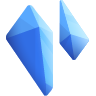
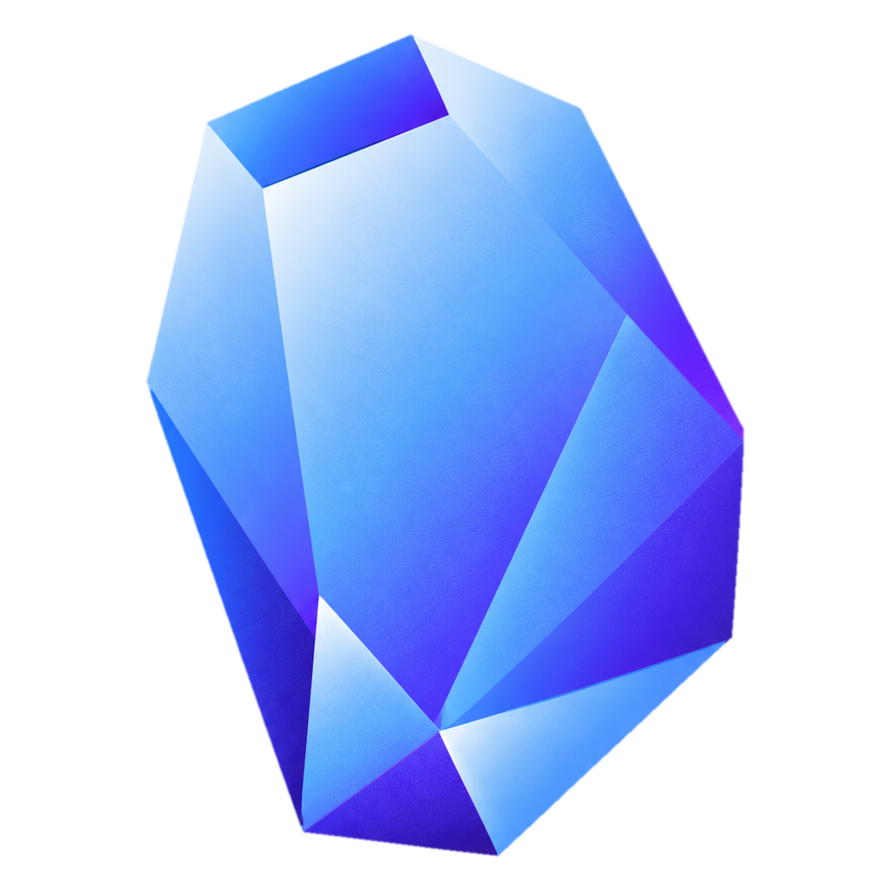
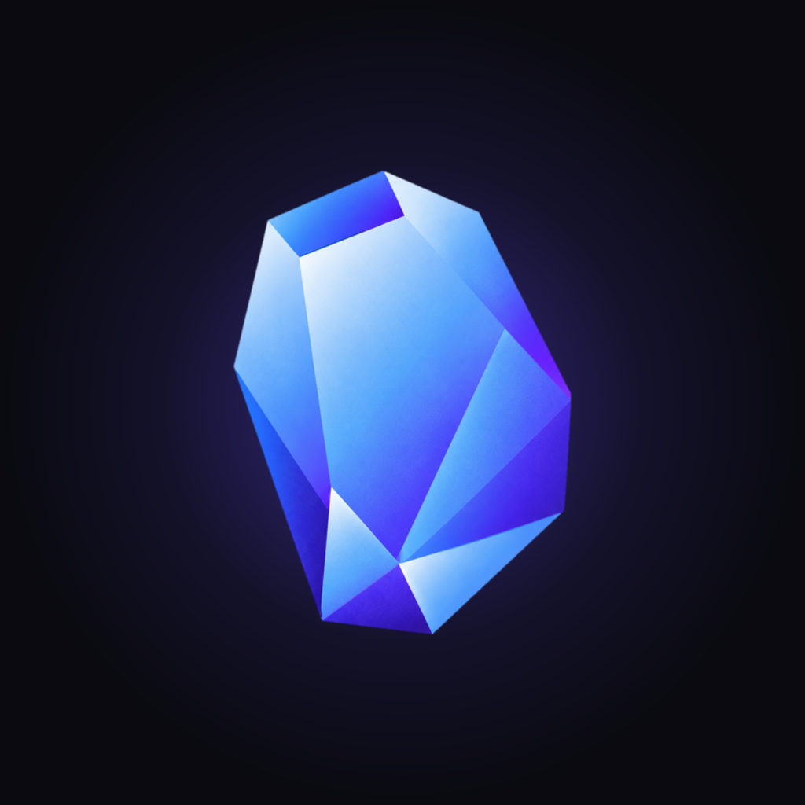
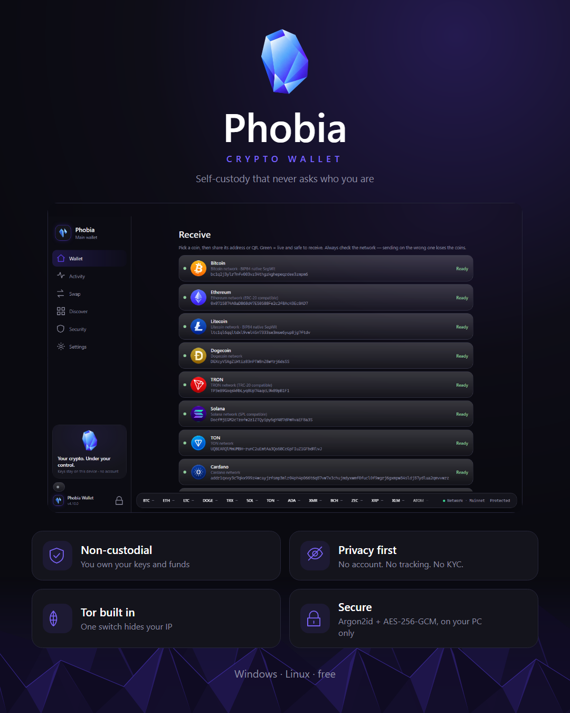
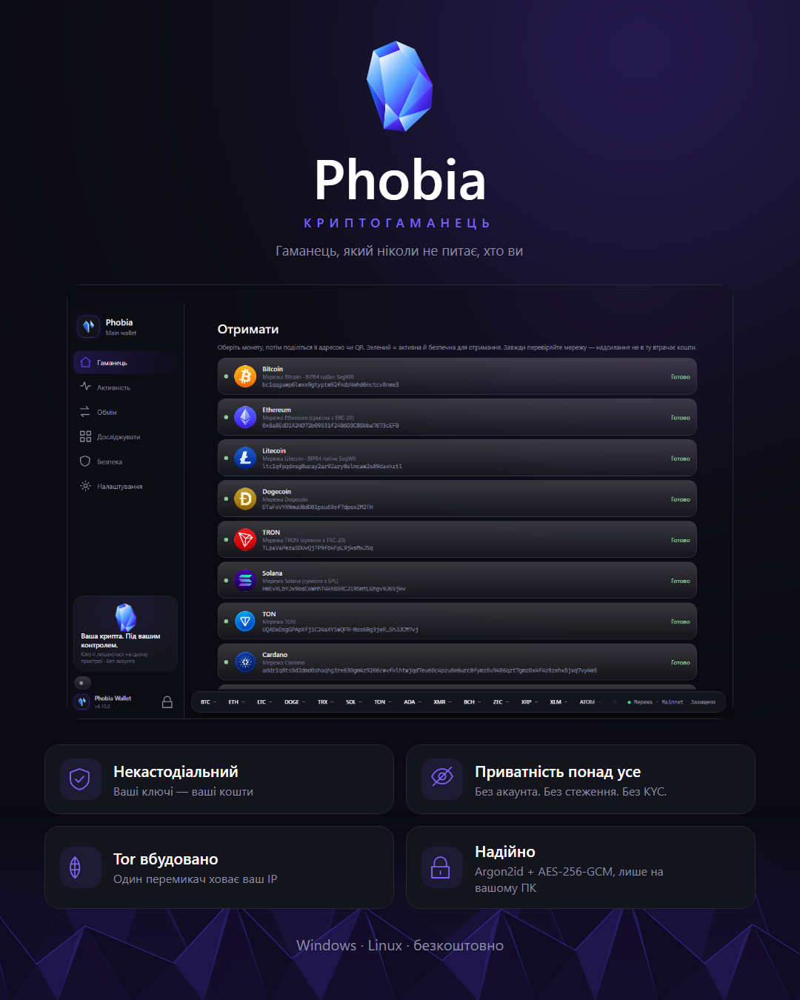
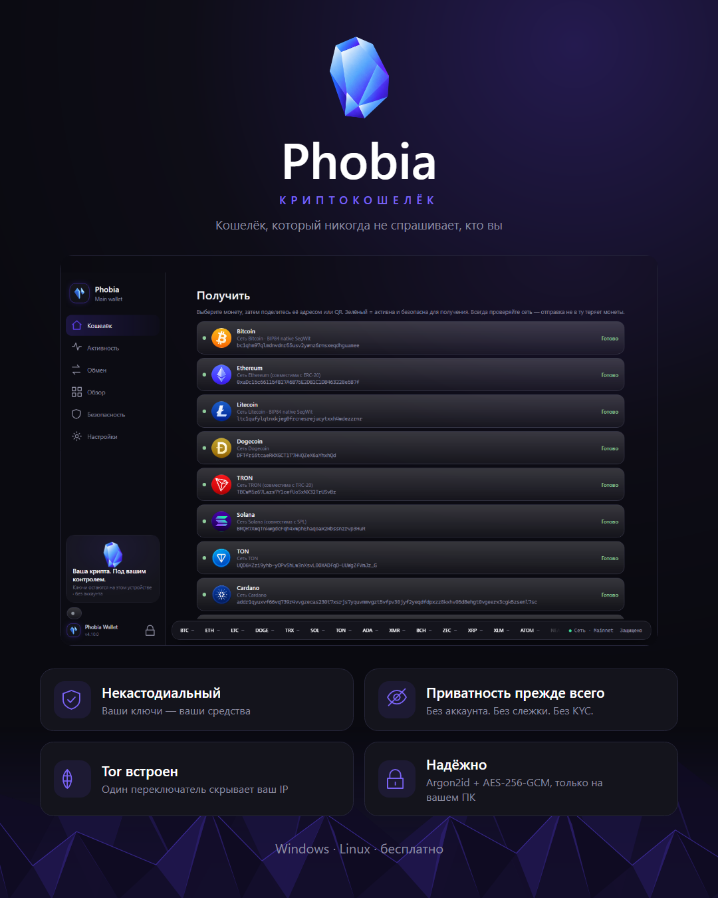
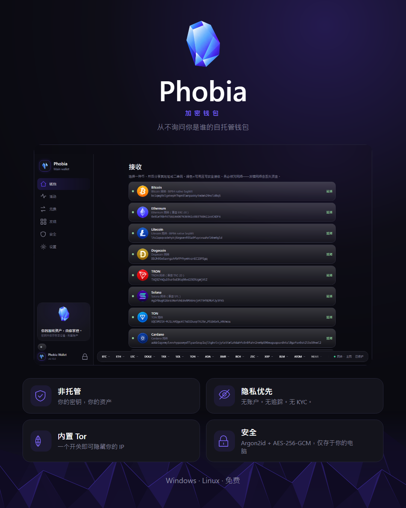
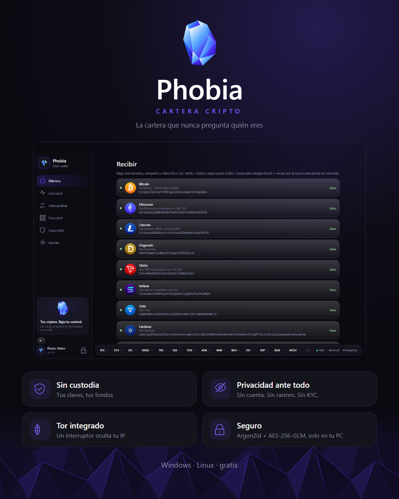
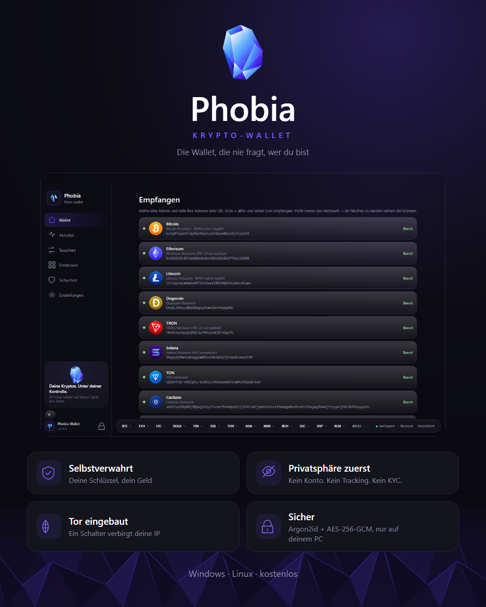
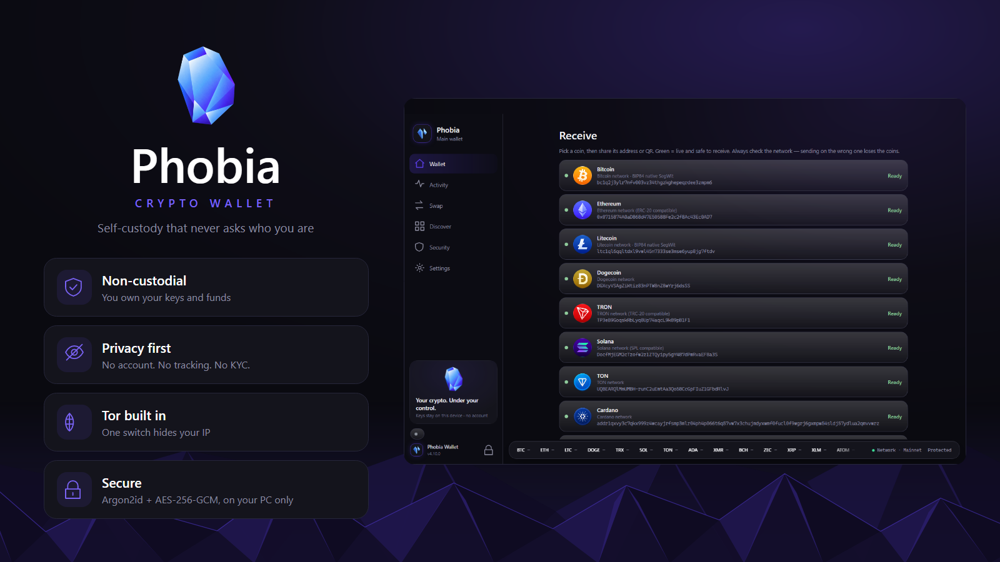

# Phobia — brand kit

Everything here is rendered from the wallet's own parts (its theme, its logos and a real screen of the app
in each language), so it always matches what people see when they open it. Use it for the channel, store
listings and posts. The trademark rules are in [TRADEMARK_POLICY.md](../TRADEMARK_POLICY.md).

## Logos

| | File | Where it is used |
|---|---|---|
|  | `phobia-logo-96.png` | **Main logo** — the two crystals. Title bar, sidebar, app icon, QR codes. The app draws it as vectors (`CrystalLogo`), so every size is sharp. |
|  | `phobia-crystal-1024.png` | **Secondary logo** — the large crystal. Launch screen, promo cards, posters. Cut out of `phobia-crystal-source.png`. |
|  | `phobia-channel.png` | Channel / profile picture (1024 × 1024). |

## Colours

| Role | Value |
|---|---|
| Page | `#0A0A10`, with a violet glow `#19132F` from the top right |
| Cards | `#14141C` on a `#22222E` hairline |
| Accent (buttons, highlights) | `#5B3FE8` — white labels, 6.3 : 1 |
| Accent, light | `#7A63F5` |
| Crystal blue (logos) | `#316EE5` → `#A6DCFF` |
| Text / secondary | `#F4F4F8` / `#8C8CA0` |
| Gains | `#3DDC97` |

Type: Segoe UI Variable (Display for headings), Inter on Linux. Headings semibold, no serifs.

## Posters

Portrait 1080 × 1350 (`phobia-poster-<lang>.png`) and landscape 1600 × 900 (`phobia-post-<lang>.png`), in
every language the wallet speaks:

| English | Українська | Русский |
|---|---|---|
|  |  |  |
| **中文** | **Español** | **Deutsch** |
|  |  |  |

