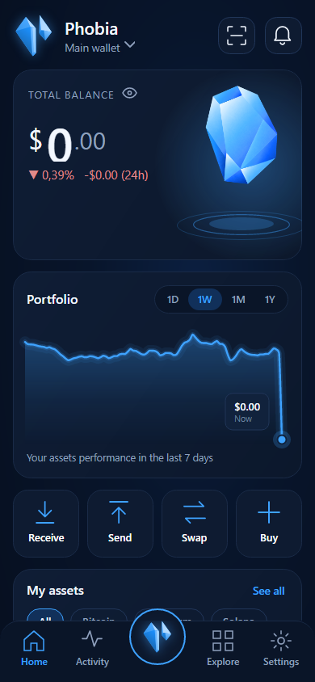
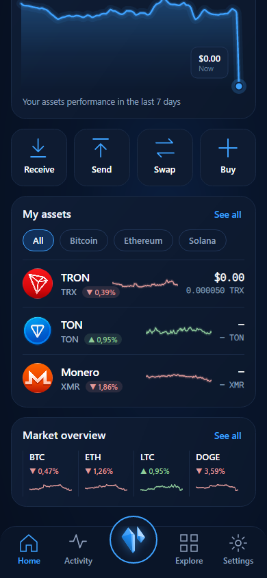
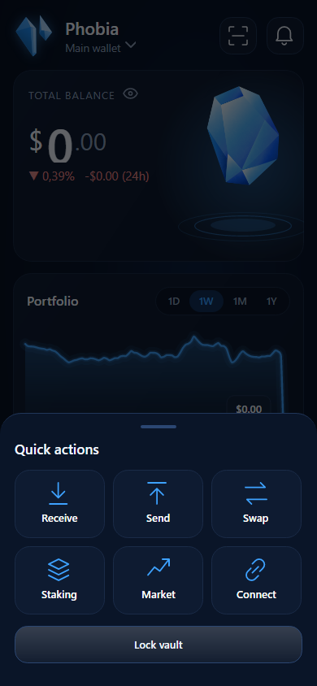

# Phobia on Android

The Android app is the same wallet as the desktop — the same keys, the same signing code, the same
coins and the same screens — laid out for a phone. A wallet made on the phone restores on the desktop
from its recovery phrase, and the other way round.

It is a **beta**, installed from the release page (an APK), not from a store.

<!-- TOC -->
- [Install](#install)
- [The home screen](#the-home-screen)
- [Moving around](#moving-around)
- [Tor on the phone](#tor-on-the-phone)
- [Monero on the phone](#monero-on-the-phone)
- [What the phone does not do yet](#what-the-phone-does-not-do-yet)
- [Security on a phone](#security-on-a-phone)
- [Updating](#updating)
- [Questions](#questions)
<!-- /TOC -->

---

  

## Install

1. On the phone, open the **[Beta release page](https://github.com/thefear078/Phobia-Wallet/releases/tag/v4.10.0-beta.5)**
   and download **`PhobiaWallet-Beta-android.apk`**. Android 7.0 or newer, 64-bit or 32-bit ARM —
   practically every phone from the last eight years.
2. Check the file before you open it. Its SHA-256 must match the `PhobiaWallet-Beta-android.apk` line
   of `SHA256SUMS-Beta.txt` from the same release. Easiest on a computer:
   ```bash
   sha256sum -c SHA256SUMS-Beta.txt --ignore-missing
   gh attestation verify PhobiaWallet-Beta-android.apk --repo thefear078/Phobia-Wallet
   ```
   then copy the checked file to the phone. The APK is also signed with the author's key —
   see [Updating](#updating) for its fingerprint.
3. Open the APK. Android asks once whether your browser or file manager may install apps — allow it
   for that app, install, and you can switch the permission off again afterwards.
4. Open **Phobia**, set a vault password, and create a wallet or import your recovery phrase — exactly
   as in [Getting started](../getting-started.md#4-first-launch).

Phobia asks for one permission: the network. No contacts, no storage, no camera, no location.

## The home screen

From top to bottom:

- **The wallet's name** — tap it to switch wallets or add one. Beside it, the scan button opens Receive
  with its QR codes, and the bell opens Activity.
- **Total balance** with its 24-hour move, in percent and in money. The eye hides the figures. When
  something new happened since you last opened Activity, a note says so — tap it to read.
- **Portfolio** — what today's coins were worth over the last day, week, month or year. Drag a finger
  along the line to read the value at any moment; the last point is the balance above it.
- **Receive, Send, Swap, Buy.**
- **My assets** — the open wallet's coins with their 24-hour move and a 7-day line. *See all* shows the
  whole list; the chips narrow it to one network. Tap a coin for its details.
- **Market overview** — Bitcoin, Ethereum, Litecoin and Dogecoin; tap one for its chart.

## Moving around

- The bottom bar: **Home**, **Activity**, the **crystal** in the middle, **Explore** (Discover: Market,
  Buy, P2P, NFTs, news and more) and **Settings**.
- The **crystal** opens quick actions: Receive, Send, Swap, Staking, Market, Connect, and Lock vault.
- The phone's **back** gesture closes an open panel, then returns to Home; at Home it leaves the app.
- Every page — Send, Swap, Staking, Connect, Security Center, Settings — is the desktop's page, with
  the same checks and the same password before anything is signed. The guides for
  [Swap](swap.md), [Staking](staking.md), [Connect](connect.md) and
  [Wallets and settings](wallets-and-settings.md) apply as written.

The phone starts in the **Ice** theme (Phobia blue). Settings → Appearance has all the others.

## Tor on the phone

The APK carries Tor itself — the Tor Project's own Android build, checked against their signed
checksums like the desktop's — so nothing else needs installing:

1. **Settings → Privacy → Tor**: switch it on. The first start takes about half a minute; the chip then
   reads **TOR**.
2. Turn on **Tor-only (block clearnet)** as well. With it on, a request that cannot go through Tor does
   not go at all, and both stay on across restarts.
3. **Verify Tor** (same page) asks check.torproject.org through the wallet's own route.

Address lookups, broadcasts, prices and swaps each get their own Tor circuit, as on the desktop. Android
may stop Tor while Phobia sits in the background; it starts again as soon as you come back, and until then
nothing goes out directly.

### Or through Orbot

If you already run [Orbot](https://orbot.app) (the Tor Project's Android app), the wallet can use it
instead of its own Tor:

1. Install **Orbot** from the Play Store, F-Droid or orbot.app, open it and press **Start**.
2. In Phobia: **Settings → Privacy → Custom proxy (SOCKS5)**, switch to **Use my proxy**, enter
   `127.0.0.1:9050` and press **Apply**. The connection chip turns to **PROXY**.
3. Turn on **Tor-only (block clearnet)** on the same tab. With it on, a request that cannot go through
   Orbot does not go at all — if Orbot is stopped, the wallet shows *Blocked* instead of quietly going
   direct. The switch stays on across restarts while the proxy is set.
4. **Verify Tor** (same page) asks check.torproject.org through the wallet's own route and says whether
   it really left through Tor.

Through Orbot the wallet keeps its circuit separation: address lookups, broadcasts, prices and swaps each
get their own Tor circuit. Do not use Orbot's VPN mode *and* the proxy at once —
the proxy alone is enough, and it is what lets the kill-switch know whether Tor is there.

## Monero on the phone

The APK also carries `monero-wallet-rpc`, the Monero project's own Android build (checked
against their signed `hashes.txt`), so XMR shows its balance and sends on the phone as on the desktop. The
first sync scans the chain from the wallet's birthday and takes a while on mobile data — keep the app open
until the balance appears. It goes through Tor when Tor is on, and runs only while the app is open.

## What the phone does not do yet

- **No installing by itself.** The wallet looks for a newer release and says so; *Download* opens the APK
  in your browser, and Android installs it — only over a copy signed with the same key (see below).
- **Not in a store.** Only the release page carries the APK. A "Phobia" in any app store is not this
  one.

## Security on a phone

- The seed and keys are encrypted with your vault password (Argon2id → AES-256-GCM), exactly as on
  the desktop, and stay in the app's private storage.
- **Android's backup is off** for Phobia: the vault never goes to a cloud backup. Your recovery phrase
  is the backup — write it on paper.
- **Seed and Monero key screens are protected**: no screenshots, no screen recording, and the
  recent-apps preview is blank while they are open.
- A phone is lost or stolen more easily than a computer. Use a screen lock, keep a strong vault
  password, and keep large amounts on a hardware wallet.

## Updating

The wallet looks for a newer release by itself, shortly after it starts and twice a day
(Settings → Updates turns that off; it goes through Tor when Tor is on). When one is out, a strip on
Home says so, and **Download** opens that release's APK in your browser. Open the downloaded file:
Android installs it over the old one and the wallet keeps its data. You can also download it from the
release page yourself and check it as in [Install](#install).

Android only installs an update that is **signed with the same key** as the copy on the phone — which
is also the proof that the update is ours. Since 7 October 2026 every APK is signed with one key, the author's:

```
SHA-256  C3:80:0E:C6:34:F3:C1:6C:84:4E:62:0B:BB:92:28:81:B6:34:C0:2B:17:40:68:D4:80:F8:9A:DA:A8:95:72:D1
```

Check it on a computer with `apksigner verify --print-certs <file>.apk` (Android SDK build-tools), or on
the phone with an app that shows signing certificates. Anything else is not an official build.

**A copy installed before 7 October 2026 needs one reinstall.** The first beta's APK (2 October) was
signed with a key made for that one build, so Android refuses a newer APK over it ("conflicts with an
existing package"). Make sure your recovery phrase is written down, uninstall Phobia, install the Beta and
import the phrase. Every update after that installs over the old copy and keeps its data.

## Questions

**Is the phone app a different wallet?** No. Same recovery phrase, same addresses, same coins. Import the
phrase on the phone and you see the desktop's wallet.

**Can I use the phone and the desktop at the same time?** Yes — both read the same chains. Each keeps its
own vault, settings and notes.

**Why is the APK so big?** It carries the .NET runtime and both ARM builds, and nothing is trimmed: the
wallet reads its own files with code that trimming would break.

---

📖 [User guides](README.md) · [Documentation Index](../INDEX.md)
