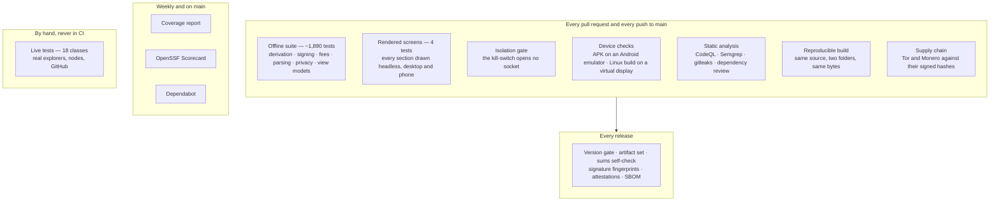

# Testing and quality assurance

About **1,890 offline tests**, **4 rendered-screen tests**, two **device checks**, three **static analysers**
and a set of release gates. This page says what each layer protects, where it runs and how to run it —
because a test count is not evidence of anything on its own.

## The layers



| Layer | Where | What a failure would have meant |
|---|---|---|
| **Offline suite** (`Umbrella.Wallet.Core.Tests`) | `ci.yml` → `desktop` | Money logic wrong: an address the reference wallet cannot spend, a fee below the relay floor, `"0,5"` read as `5` |
| **Rendered screens** (`Umbrella.Wallet.UiTests`) | `ci.yml` → `desktop` | A screen that shows an object's type name instead of words, or throws when drawn |
| **Isolation** (`Category=Isolation`) | `ci.yml` → `network-isolation` | Tor-only mode letting a request out directly |
| **Device checks** | `device-check.yml` | The APK crashing on start, or its bundled Tor never bootstrapping; the Linux build unable to reach Tor |
| **Reproducible build** | `ci.yml` → `reproducible-build` | A binary nobody can rebuild to the same bytes — a checksum that proves nothing |
| **Supply chain** | `ci.yml` → `supply-chain` | A Tor or Monero binary that does not match its project's signed hash list |
| **Static analysis** | `codeql.yml`, `semgrep.yml`, `security.yml` | A known vulnerability pattern, a leaked secret, a vulnerable dependency, an unsafe workflow |
| **Release gates** | `release.yml` | A release with a missing or misnamed file, a sums file that does not match, a signature by any other key |
| **Live tests** (`Category=Live`) | by hand | A public service changing its answers under the wallet |

## Running them

```bash
# the default: fully offline and deterministic — what CI runs
dotnet test desktop/Umbrella.Wallet.sln -c Release --filter "Category!=Live"

# one area
dotnet test desktop/Umbrella.Wallet.sln -c Release --filter "FullyQualifiedName~Decred"

# the live tests, against real explorers and nodes (one at a time, a few minutes)
dotnet test desktop/Umbrella.Wallet.sln -c Release --filter "Category=Live"

# with coverage (coverlet), then a summary table. Debug and an empty PathMap: the reproducible
# Release settings leave coverlet no symbols and no source paths to map lines to
dotnet test desktop/Umbrella.Wallet.sln -c Debug -p:PathMap= --filter "Category!=Live" --collect:"XPlat Code Coverage" --results-directory coverage
python3 scripts/coverage-summary.py coverage
```

**Live tests** run in one collection, one at a time (`LiveNetworkCollection`): they lift the suite's
offline wall for the duration, and when they ran side by side one class put the wall back up under the
others — a run reported GitHub, XRP and Polkadot "down" when all three were answering. A test fails if a
live class is left out of that collection. A live failure means the service: on 2026-10-09, 48 of 49
passed; the one left was an explorer rate-limiting this machine after a day of testing.

## What the suite protects

### Money

| Area | Pinned to | What a failure would have meant |
|---|---|---|
| Derivation | official vectors and reference libraries (`@ton/ton`, `cardano-serialization-lib`, cosmjs, polkadot.js, near-api-js, Trust Wallet Core…) | An address the user is told to use that the original wallet cannot spend |
| Signing | BIP vectors, NBitcoin, the Stellar Go SDK, xrpl.js, **transactions the networks accepted** (Decred, Nano, Zcash) | A transaction the network refuses — or one that spends differently than shown |
| `AmountInput` | locale cases | `"0,5"` read as `5` — ten times the intended amount |
| Spend planning | fee and dust rules of each chain | A fee below the relay floor; change below dust; coins the user excluded spent |
| Partial scans | explorer failure cases | A degraded network read shown as "your balance went down" |
| Broadcast answers | each explorer's wording | "Already in the mempool" read as a failure — and a retry that pays twice |

### Privacy

| Area | What it pins |
|---|---|
| Circuits | A SOCKS5 server on loopback reads each request's circuit label off the handshake |
| Kill-switch | A listener on loopback must see no connection while Tor-only is on |
| Counterparties | Every host in the code is declared with what it learns (`NetworkCounterpartyTests`) |
| Address scanning | The concurrent scan never asks about more addresses than a sequential walk would |
| Price requests | One fixed list for every wallet — what you hold is never in the request |

### What the user sees

| Area | What it pins |
|---|---|
| Rendered screens | Every section drawn with the real styles, desktop and phone |
| Localization parity | No language is missing a key another has; no translation drops a `{0}` |
| Theme contrast | Every theme clears WCAG AA for body, muted and button text |
| Documentation | The README and roadmap coin tables match what the code can send; versions agree everywhere |

## Coverage

Published weekly and on every push to `main` by `coverage.yml` (the summary is on the run's page; the
Cobertura files are its artifact). It is a map of what is untested, not a score: the money and privacy
paths above are pinned by what they assert, not by how many lines they run.

Measured on 2026-10-09 (offline suite, 1,893 tests):

| Assembly | Lines | Line coverage | Branch coverage | What is in it |
|---|---:|---:|---:|---|
| `Umbrella.Wallet.Core` | 16,418 | **90.6 %** | 74.0 % | Derivation, transaction formats, signing, fees, amounts, Privacy Radar |
| `Umbrella.Wallet.Infrastructure` | 17,990 | 41.9 % | 35.4 % | Explorers, nodes, Tor, the Monero service — mostly exercised by the live tests, which this run leaves out |
| `Umbrella.Wallet.App` | 51,060 | 54.1 % | 34.9 % | View models and XAML-generated code |
| **Total** | **85,468** | **58.5 %** | **45.6 %** | |

The low figure that matters is Infrastructure's: an explorer's answer is read by code that only the live
tests run. Pinning more of those readers to recorded answers is a good contribution.

## Writing a test here

**Offline and deterministic.** No network, no clock dependence, no ordering assumptions. A test that needs
the internet gets `[Trait("Category", "Live")]` and `[Collection(LiveNetworkCollection.Name)]` — two tests
enforce both.

**Say what a failure means.** The class doc explains the bug being prevented, not the method:

```csharp
// ❌ tells a future reader nothing
/// <summary>Tests the amount parser.</summary>

// ✅ explains why this exists
/// <summary>
/// "0,5" must be a half, never five. A naive invariant parse reads a comma-decimal amount as ten
/// times the intended value, which on a send is somebody's money.
/// </summary>
```

**Pin to something independent.** A signing test that compares the wallet's output with the wallet's own
earlier output proves nothing. Use published vectors, a reference library's output, or a transaction the
network accepted.

**Weight the negative cases.** For anything that hides or blocks, the dangerous failure is the false
positive. `SpamTokenInspectorTests` has more tests asserting that ordinary tokens are *not* flagged than
that spam is — wrongly hiding someone's money is worse than showing spam.

**Verify a guard actually guards.** After writing a rule-enforcing test, break the rule on purpose and
confirm it fails, then revert. A guard that passes vacuously looks like coverage and is not.

### View models

`MainViewModel` is constructible directly, against a temporary directory — never a real wallet:

```csharp
var vm = new MainViewModel(new EncryptedFileSeedVault(Path.Combine(dir, "vault.json")));
```

A new or unlocked wallet starts a refresh by itself. Without a UI thread it runs on the thread pool, so
wait for it (`BackgroundRefresh.SettleAsync(vm)`) before reading `Accounts` or `Holdings`.

## Gaps — being honest

- **No fuzzing** of the address parsers and transaction decoders yet.
- **Monero on a real phone** is not checked by CI: Monero publishes no x86_64 Android build, and Google's ARM
  translation on the emulator stops the .NET runtime itself.
- **No external audit.** The suite is evidence, not a substitute.
- **No second reviewer.** Every change is read by one maintainer and the machines above.

Those are where a contribution would matter most — see [CONTRIBUTING.md](../CONTRIBUTING.md).

---

📖 Back to the [README](../README.md) · [Documentation index](INDEX.md)
